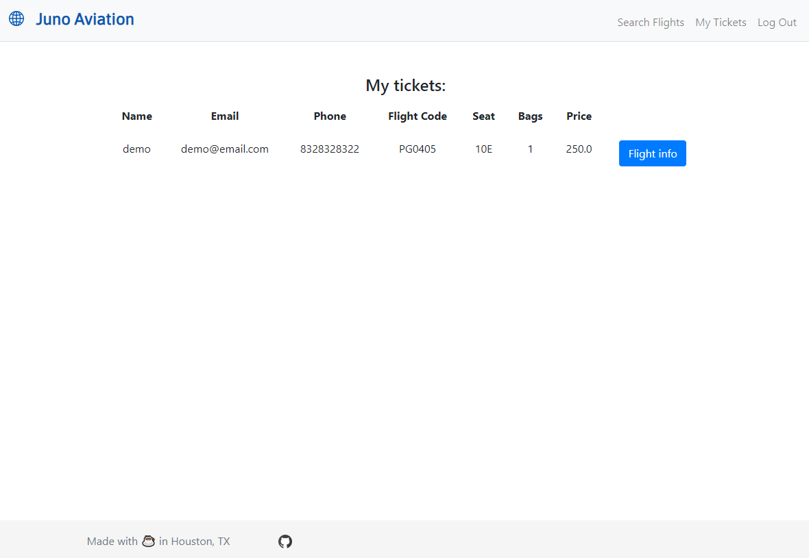

# airline
Simple (mock) airline website built using (but not limited to) Flask, Jinja, and PostgreSQL. User information is stored securely (passwords are hashed) but I still do not recommend uploading sensitive information through the site. Also note that the application is best experienced on medium-sized mobile devices (iPhone 6 or larger) and standard desktop displays.

## Live Site

[Click here](https://juno-aviation.herokuapp.com) to visit a live deployment of the website. Please note that there are only a few available flights due to limitations in the size of the database offered for my free heroku app, forcing me to trim the database from ~30,000 entries to ~3,000 entries.

## Basic Functionality

Searching for one-way flight from Moscow -> St. Petersburg on 12/16/20

Results of the search

Selecting flight PG0405

Input ticket information

Show currently purchased tickets

